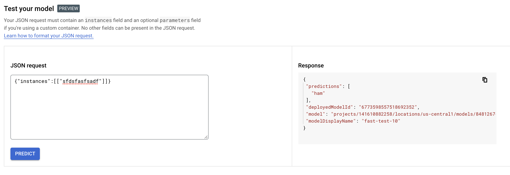

#Testing vertex prediction custom container

Steps to take
1. build the app with the relevant function which accepts a post according to requirements.
2. build the docker.
3. Run and test the docker locally
4. Deploy to the gcloud
4.1 tag & push docker image from step #2 to an Artifact Repository in a project of your choice.
4.2 Import (called upload) container from Artifact Repository into Vertex Model registry.
4.3 From Model registry deploy the model to an Endpoint.
5. Test the model by going back to the Model registry and using the UI in Model registry or testing.py script.

Step 1. + 2. + 3.
docker build -t testimage .
docker run -d -p 8080:8080 testimage

Step 4.1
docker tag testimage us-central1-docker.pkg.dev/kubeflow-demos/repo-models/container_model_test

docker push us-central1-docker.pkg.dev/kubeflow-demos/repo-models/container_model_test

Step 4.2
gcloud beta ai models upload \
  --region=us-central1 \
  --display-name=fast-test-10 \
  --container-image-uri=us-central1-docker.pkg.dev/kubeflow-demos/repo-models/container_model_test \
  --container-ports=8080 \
  --container-health-route=/health_check

5.
For local testing use:
  curl -X 'POST' \
  'http://localhost:8080/predict' \
  -H 'Content-Type: application/json' \
  -d '{"instances":[["sfdsfasfsadf"], ["sfdsfasfsadf"]]}'

For testing after deploying in the cloud through the UI:
{"instances":[["sfdsfasfsadf"], ["sfdsfasfsadf"]]}

# Addtional info
## Requirements for the container
https://cloud.google.com/vertex-ai/docs/predictions/custom-container-requirements

Specifically, the container must listen and respond to liveness checks,
health checks, and prediction requests.

Your HTTP server must listen for requests on 0.0.0.0, on a port of your choice

Liveness checks don't need to be handled

When a client sends a projects.locations.endpoints.predict request to the Vertex AI API,
Vertex AI forwards this request as an HTTP POST request to a configurable prediction path on your server.
